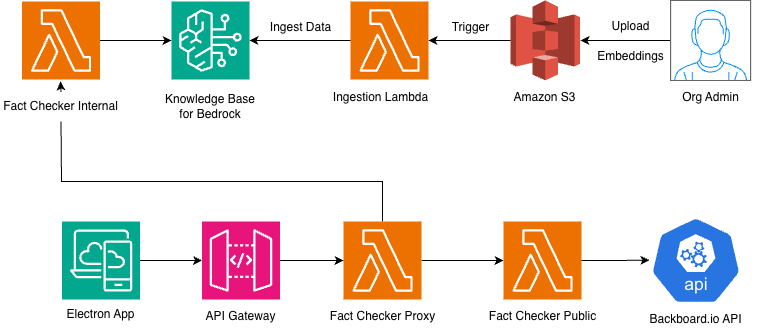

# Verity
### Real-time fact verification for the copy-paste world

[](#quick-start)
[](#license)
[](#team-heart_overflow)

Verity is a desktop fact-checking system by **Team Heart_Overflow** that validates copied text using both public and internal sources.

## Why Verity?

Misinformation and stale internal knowledge both create costly errors. Verity checks claims in context by combining:
- Public web verification
- Internal company knowledge base verification

## How It Works

1. User copies text in any app.
2. Verity captures clipboard text.
3. API orchestration triggers concurrent internal + external checks.
4. Verity returns verdict, confidence, source, and citations.

## Architecture

### System Diagram



## Quick Start

```bash
cd HeartOverflowElectron
npm install
npm start
```

## Team Heart_Overflow

- Verity hackathon project
- Focus: real-time, contextual fact-checking across apps

## License

MIT
